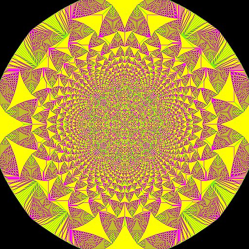
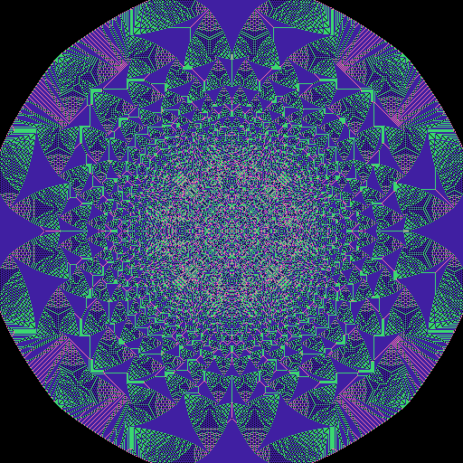

# Colouring the Abelian Sandpile Model

This is a fun exercise to get a nice colour palette for the [Abelian
sandpile model](https://en.wikipedia.org/wiki/Abelian_sandpile_model)
which I used for the coursework on the 2025/26 on-campus run of the
Message-Passing Programming course. It's a very simple 2D cellular
automaton where you have piles of grans of sand at each cell. The only
rule is that, each step, if a pile is four or more grains high it
sheds a grain to each of its four nearest neighbours. Eventually you
reach a situation where all sandpiles are 0, 1, 2 or 3 grains
high. The output image is coloured by height and, remarkably for such
a simple model, shows really interesting fractal patterns:

<p align="center">
    
</p>

The defaut colours I used for the four heights were black, green, magenta and yellow. However, I'm sure there are nicer ways to colour the picture.

**The challenge is to find the prettiest (in my opinion!) colouring**

I've provided a simple script for you to play around with the colour palette; the colours are specified as RGB triplets (I always use black for zero grains). For example,
to reproduce the colouring above:
````
./sandcolour.sh 0 1 0  1 0 1  1 1 0
palette: h1=(0,1,0); h2=(1,0,1); h3=(1,1,0)
converting <sand512.dat> to <sandnew.ppm> ...
... done
````
I think the PPM format is reasonably widely supported - it can definitely be viewed (or converted to, say, PNG) using `display` (or `convert`) from the ImageMagick suite.

If you want, you can play around with random colourings:

````
./sandcolour.sh $((RANDOM%255)) $((RANDOM%255)) $((RANDOM%255)) $((RANDOM%255)) $((RANDOM%255)) $((RANDOM%255)) $((RANDOM%255)) $((RANDOM%255)) $((RANDOM%255))
palette: h1=(212,100,138); h2=(49,181,93); h3=(54,26,135)
converting <sand512.dat> to <sandnew.ppm> ...
... done
````
<p align="center">
    
</p>

**Email your best colour palette to me, d.henty@epcc.ed.ac.uk, by close
  of play on Monday 12th January 2026**
